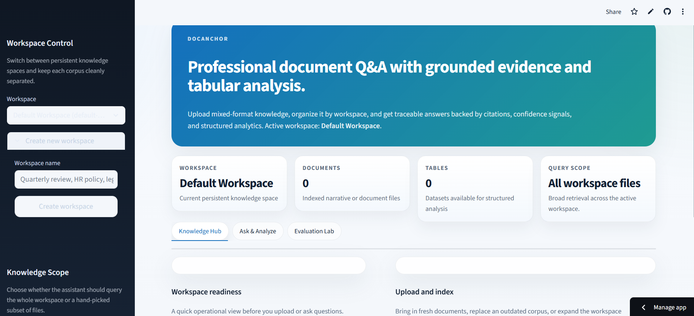
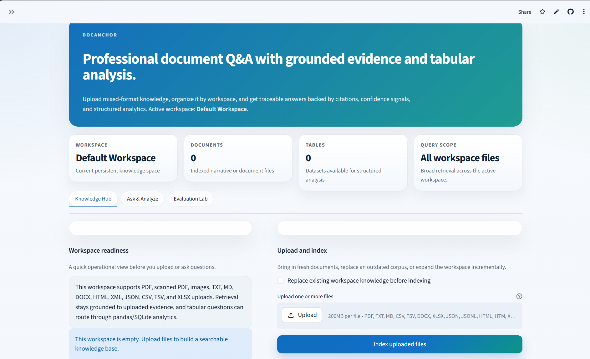
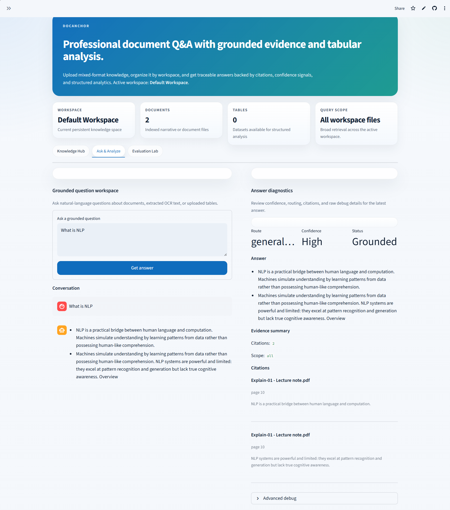
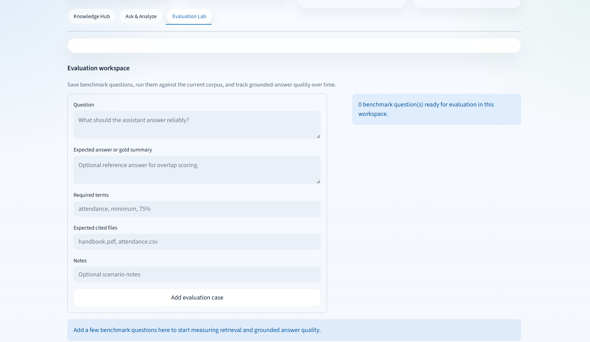
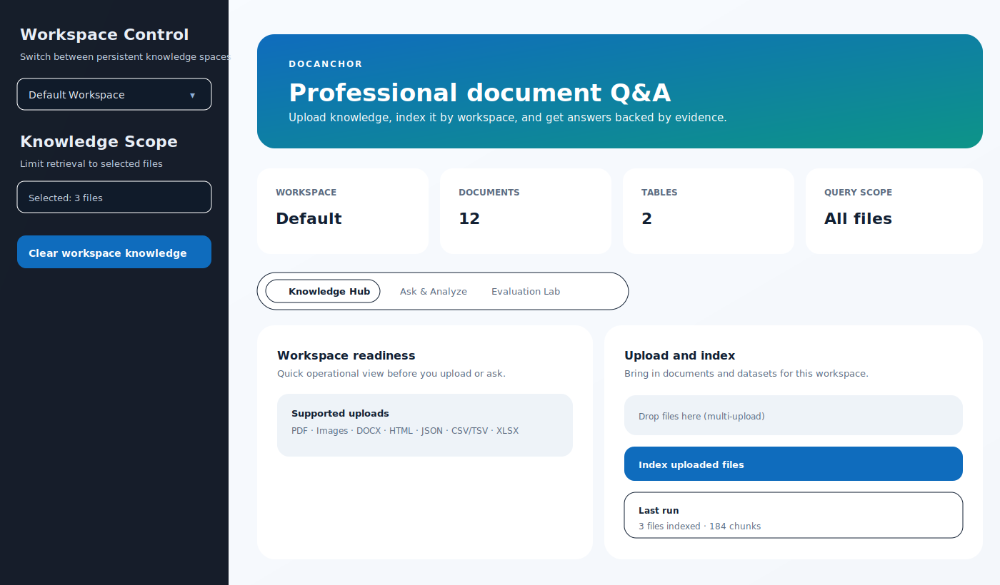
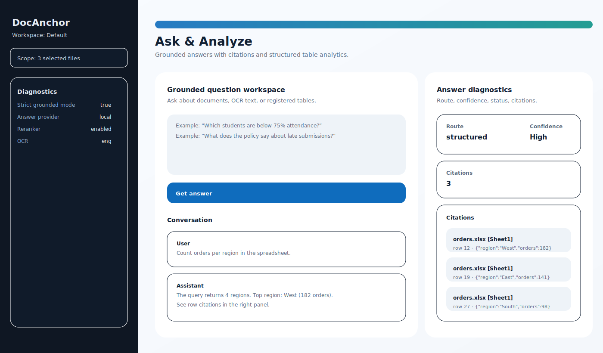
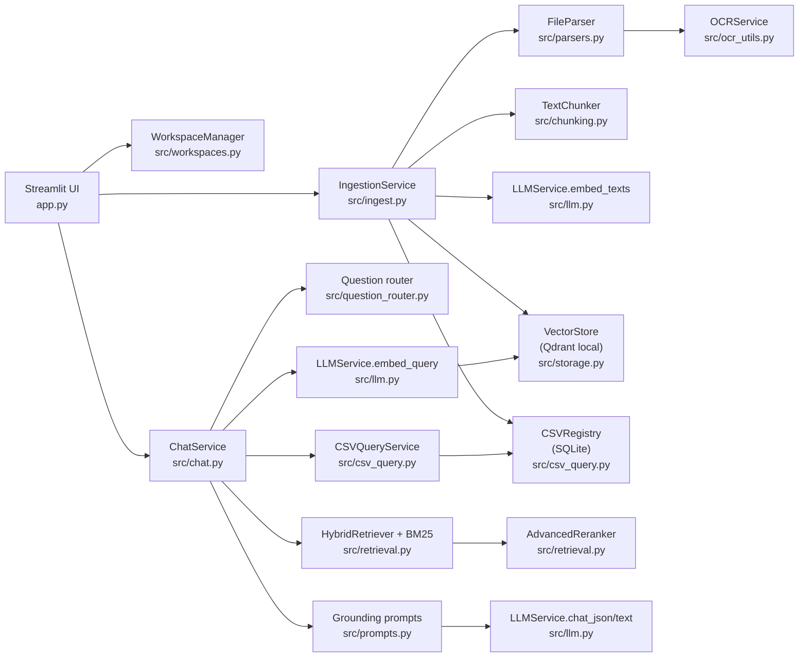
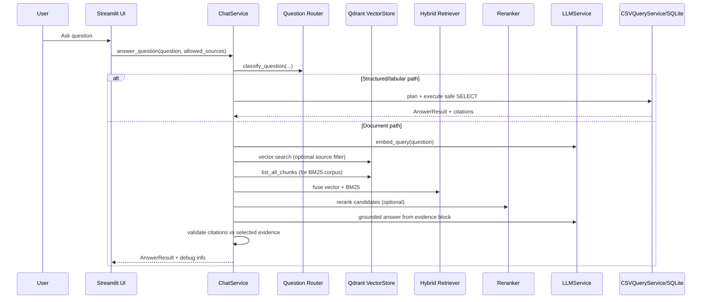

# DocAnchor (Streamlit RAG + Tabular Analytics)

Grounded Q&A for uploaded documents and spreadsheets, with citations you can verify. Organize knowledge into workspaces, index mixed file types, and route questions through either document retrieval or safe SQLite analytics.

## :sparkles: Highlights

- **Workspaces**: separate corpora with isolated vector + tabular storage.
- **Multi-format ingestion**: PDF, scanned PDF, images, TXT/MD, DOCX, HTML/XML, JSON/JSONL, CSV/TSV, XLSX.
- **Hybrid retrieval**: dense vectors + BM25 fusion, optional cross-encoder reranking.
- **Strict grounding**: answers must be supported by the evidence block; citations are validated post-answer.
- **Tabular analytics**: tabular questions can run read-only SQLite queries with guardrails and row-level citations.
- **OCR fallback**: Tesseract OCR kicks in for sparse PDF pages and uploaded images when available.

## :camera: Screenshots

Real app screenshots (from the repo root):

| Knowledge Hub | Upload & Index |
| --- | --- |
|  |  |

| Ask & Analyze | Evaluation Lab |
| --- | --- |
|  |  |

<details>
<summary>Design previews (SVG)</summary>




</details>

## :rocket: Quickstart (Local)

1. Create a virtual environment and install dependencies.

```powershell
python -m venv venv
.\venv\Scripts\Activate.ps1
pip install -r requirements.txt
```

2. Configure environment variables.

```powershell
Copy-Item .env.example .env
```

3. Run the app.

```powershell
streamlit run app.py
```

## :gear: Configuration

Configuration is read from `.env` (local) and Streamlit secrets (deployment). See `src/config.py` for the full list.

Common settings:

```toml
# Providers
ANSWER_PROVIDER="local"          # local | openai
EMBEDDING_PROVIDER="local"       # local | openai

# OpenAI (only used when *_PROVIDER=openai)
OPENAI_API_KEY="..."
OPENAI_CHAT_MODEL="gpt-4o-mini"
OPENAI_EMBEDDING_MODEL="text-embedding-3-large"

# Local (Ollama)
OLLAMA_BASE_URL="http://localhost:11434"
OLLAMA_CHAT_MODEL="phi3"
LOCAL_LLM_TIMEOUT_SECONDS="120"
LOCAL_EMBEDDING_MODEL="sentence-transformers/all-MiniLM-L6-v2"

# Storage
QDRANT_STORAGE_PATH=".qdrant"
APP_DATA_DIR="data"
COLLECTION_NAME="knowledge_base"
SQLITE_DB_NAME="csv_data.sqlite"

# Retrieval
MAX_CONTEXT_CHUNKS="6"
RERANK_CANDIDATES="20"
BM25_CANDIDATES="20"
MIN_SIMILARITY_SCORE="0.28"
ENABLE_CROSS_ENCODER_RERANKER="true"
RERANKER_MODEL_NAME="cross-encoder/ms-marco-MiniLM-L-6-v2"
STRICT_GROUNDED_MODE="true"

# OCR
OCR_ENABLED="true"
OCR_LANGUAGE="eng"
OCR_MIN_TEXT_CHARS="80"
OCR_ON_SHORT_PDF_PAGES="true"
OCR_MAX_PDF_PAGES="30"
```

Notes:

- `data/` is runtime state (uploads, SQLite, workspace registry) and is intentionally ignored by git.
- Changing embedding models changes vector dimensionality; if Qdrant has an existing collection with a different size, reindex by clearing workspace knowledge.

## :building_construction: System Architecture

### Component view



### Question answering flow



## :card_index_dividers: Repository Map

- `app.py`: Streamlit UI (Workspaces, Upload & Index, Ask & Analyze, Evaluation Lab).
- `src/config.py`: environment-based settings and workspace-scoped paths.
- `src/workspaces.py`: workspace registry and workspace lifecycle.
- `src/ingest.py`: ingestion pipeline (parse → chunk → embed → upsert).
- `src/parsers.py`: file parsing for all supported types + OCR integration for PDFs/images.
- `src/ocr_utils.py`: Tesseract OCR helper (image + PDF pages).
- `src/chunking.py`: section-aware chunking with overlap.
- `src/storage.py`: Qdrant local vector store wrapper.
- `src/retrieval.py`: BM25 + dense fusion, optional cross-encoder reranking, evidence block formatting.
- `src/chat.py`: question routing, retrieval, grounded answering, citation validation.
- `src/csv_query.py`: CSV/XLSX registry, SQLite execution, safe SQL planner/answering, row citations.
- `src/prompts.py`: strict grounding prompts for document answers + SQL answering.
- `src/evaluation.py`: save evaluation cases and score grounded/citation outcomes.
- `src/models.py`: dataclasses for chunks and answer results.

## :cloud: Deployment (Streamlit Cloud)

- Put secrets in `.streamlit/secrets.toml` or Streamlit Cloud secrets.
- `packages.txt` is included for OCR system dependencies in environments that support it.

## :mag: Troubleshooting

- **OCR doesn’t run**: ensure Tesseract is installed and available on PATH; `OCR_ENABLED=true` must be set.
- **Cross-encoder reranker is slow**: set `ENABLE_CROSS_ENCODER_RERANKER=false` to use the heuristic reranker.
- **Vector size mismatch**: clear workspace knowledge and reindex after switching embedding models.
